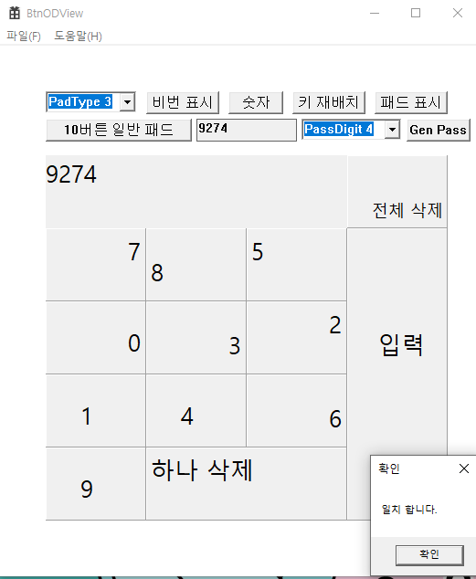
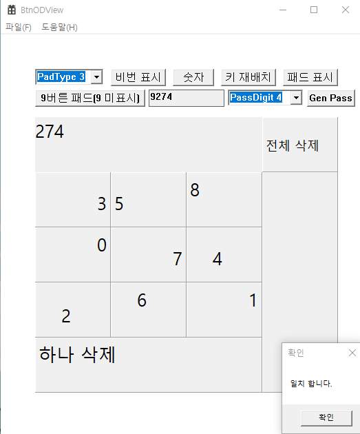

// 만든 목적 
버튼 출력시 정중앙 배치를 배제한다. 
이유는 만약 악의적인 프로그램이 클릭시 정중앙에 있는 버튼의 이미지를 분석해 
클릭 숫자를 탈취하기 어렵게 하기위해 작성해 본다. 
 
버튼의 여백을 적용하고 
여백을 제외한 특정 위치에 버튼의 글자를 출력한다. 
비번 입력시 사용되는 버튼(주로 0에서 9 까지의 수를 출력) 
 
 
// 2025-0709 
// 키 페드 버튼만 구현 
// 버튼 클릭에 대한 이벤트 구현 예정 
 
// 2025-0711 
키 페드 구현 완료 
다음 예정은 CMy 클래스를 dll로 구현할 예정 
 
// 2025-0713 
스마트 포인터 사용 gdi 객체 자동 닫기 구현 
using을 이용 스마트 포인터 선언의 간략화 구현 
SpGdi.h 참조 
 
// 2025-0714 
키 페드 출력 dll 클래스로 작성 후 
App 이 dll을 이용해 키 페드 출력을 하게 만들었음. 
 
// 2026-0706 
프로젝트 속성 변경(dll 부터 컴파일 되게 종속성 설정) 
 
// 2026-0913 
9버튼 패드 기능 추가(특정 숫자 한개를 입력을 하지 않고 비번을 입력해야 함.)  
9버튼을 한 이유는 
어쩔때는 기존 비번 그대로(스킵할 버튼의 숫자가 아닐때) 
 
다를 때는(스킵할 버튼의 숫자가 비번에 있을 때) 
숫자 자리 하나 이상의 생략으로 
훔쳐보기가 어렵게 하고 
 
비번입력이 틀렸을때는 
키 패드 배치를 재 생성 하여 여러번 반복해도 같은 환경으로 비번이 뚫리기 어렵게 하기 위한 트릭임. 
  
 
  
 

